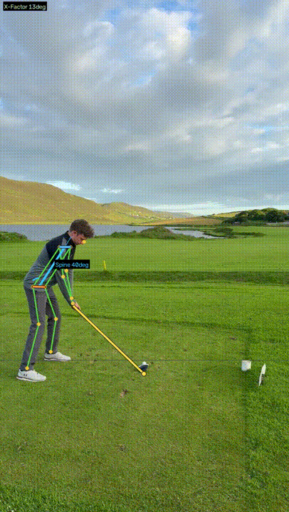

# GolfSwingAI



Upload a video of your golf swing, get frame-by-frame analysis, biomechanical metrics, and drills — all running locally, no paid APIs.

## Demo

See [`VideoEdit.webm`](VideoEdit.webm) for an example of an annotated swing produced by the app — skeleton overlay, spine angle, and detected club shaft drawn on every frame.

## What it does

- Extracts your swing from the video and detects real swing events (address, top of backswing, impact, finish)
- Runs [MediaPipe Pose Landmarker](https://developers.google.com/mediapipe/solutions/vision/pose_landmarker) on each frame — 33 body keypoints in 2D + 3D
- Detects the club shaft via Canny edge + Hough line transform anchored to the wrists
- Computes real biomechanical metrics: spine tilt, shoulder/hip rotation, X-factor, tempo ratio, head movement, shaft plane
- Generates a phase-by-phase scorecard (Setup / Backswing / Top / Downswing / Finish) with specific findings and drills
- Renders an annotated video of the swing with skeleton, reference lines, angle overlay, and detected shaft
- Saves each analysis to browser localStorage so you can track your metrics over time

## Stack

- **Backend**: Python 3.13, FastAPI, MediaPipe, OpenCV, NumPy
- **Frontend**: React + Vite, plain CSS modules
- **No external APIs** — everything runs locally

## Running it locally

### Prerequisites

- Python 3.10+ (3.13 tested)
- Node.js 18+

### Setup

```bash
# Backend
cd backend
pip install -r requirements.txt

# Frontend
cd ../frontend
npm install
```

### Start

Either run `start.bat` (Windows) or start each service manually:

```bash
# Terminal 1 — backend
cd backend
python main.py

# Terminal 2 — frontend
cd frontend
npm run dev
```

Then open http://localhost:5173

On first run, the MediaPipe pose model (~10MB) auto-downloads to `backend/models/`.

## Project layout

```
backend/
  main.py          FastAPI app + /analyze endpoint
  analyzer.py      Full pipeline: sampling, pose, events, tempo, plane, overlay video
  pose.py          MediaPipe detection + 2D/3D metrics + skeleton drawing
  swing.py         Phase scorecard, feedback engine, fundamentals score
  club.py          Golf-shaft detection via Hough line transform
  models/          Auto-downloaded MediaPipe model (gitignored)
  renders/         Generated overlay videos (gitignored)

frontend/
  src/
    App.jsx                          Top-level state machine
    components/
      VideoUpload.jsx                Drag & drop uploader
      AnalysisResults.jsx            Results view with all cards
      PhaseScorecard.jsx             Per-phase Good / Watch / Issue cards
      SwingHistory.jsx               Recent analyses from localStorage
      ProgressChart.jsx              Metric trends over time
```

## Notes on accuracy

This is a body-mechanics analyser. It measures visible pose and (when possible) the shaft — but it does **not** know whether you actually made contact with the ball. A whiff can still show sound body fundamentals. Scores are intentionally hedged and language is descriptive rather than diagnostic.

Camera-view detection prefers face-on or down-the-line footage; ambiguous angles will give rougher numbers. 3D world landmarks reduce camera-angle sensitivity for spine and rotation metrics.
